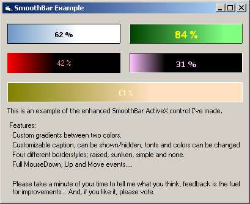



## SmoothBar v1\.1

### Description

This is an ActiveX progressbar with a few features that I thougth one migth need... I really would like to add a horisontal option but haven't figured out how to draw rotated text.. But I'm getting there :) Plz, comment and vote.
 
### More Info
 

             |
---                |---
**Submitted On**   |2002-03-06 11:00:52
**By**             |[Persona non grata](https://github.com/Planet-Source-Code/PSCIndex/blob/master/ByAuthor/persona-non-grata.md)
**Level**          |Intermediate
**User Rating**    |4.3 (13 globes from 3 users)
**Compatibility**  |VB 6\.0
**Category**       |[Custom Controls/ Forms/  Menus](https://github.com/Planet-Source-Code/PSCIndex/blob/master/ByCategory/custom-controls-forms-menus__1-4.md)
**World**          |[Visual Basic](https://github.com/Planet-Source-Code/PSCIndex/blob/master/ByWorld/visual-basic.md)
**Archive File**   |[SmoothBar\_59725362002\.zip](https://github.com/Planet-Source-Code/persona-non-grata-smoothbar-v1-1__1-32394/archive/master.zip)

